---
## Front matter
lang: ru-RU
title: Лабораторная работа №4
subtitle: "Операционные системы"
author:
  - Бекназарова Виктория Тиграновна.
institute:
  - Российский университет дружбы народов, Москва, Россия
  
date: 01 марта 2023

## i18n babel
babel-lang: russian
babel-otherlangs: english

## Formatting pdf
toc: false
toc-title: Содержание
slide_level: 2
aspectratio: 169
section-titles: true
theme: metropolis
header-includes:
 - \metroset{progressbar=frametitle,sectionpage=progressbar,numbering=fraction}
 - '\makeatletter'
 - '\beamer@ignorenonframefalse'
 - '\makeatother'
---

## Цели и задачи

Приобретение практических навыков взаимодействия пользователя с системой по-
средством командной строки.

## Содержание исследования

1. Определим полное имя нашего домашнего каталога. Далее относительно этого ката-
лога будем выполняться последующие упражнения. 

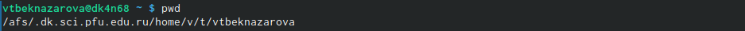{#fig:001 width=90%}

##

2. Перейдем в каталог /tmp.Выведем на экран содержимое каталога /tmp. Для этого используем команду ls с различными опциями. 

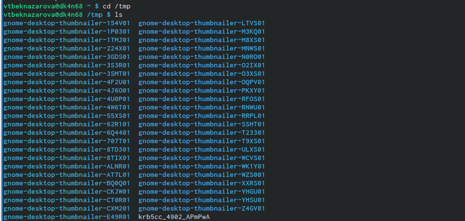{#fig:002 width=90%}

##

 Мы можем увидеть содержимое каталога со скрытыми файлами при помощи опции -а 

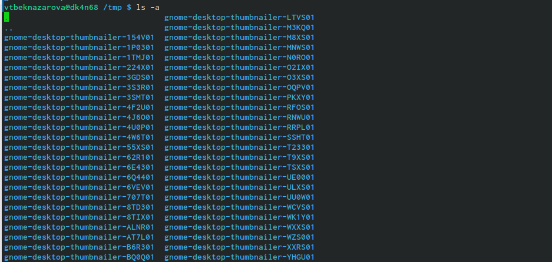{#fig:003 width=90%}

##

При помощи опции -l, мы можем увидеть подробное содержимое каталога. 

 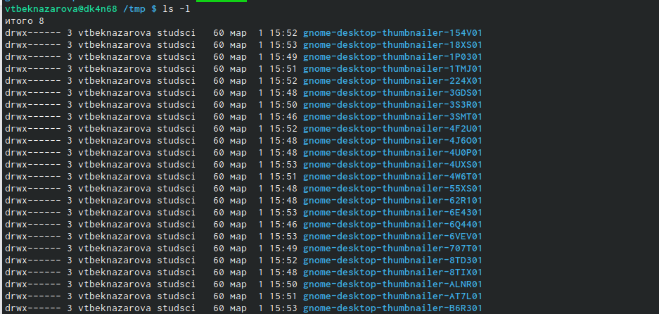{#fig:004 width=90%} 

##

При помощи опции -f можем увидеть файлы списком 

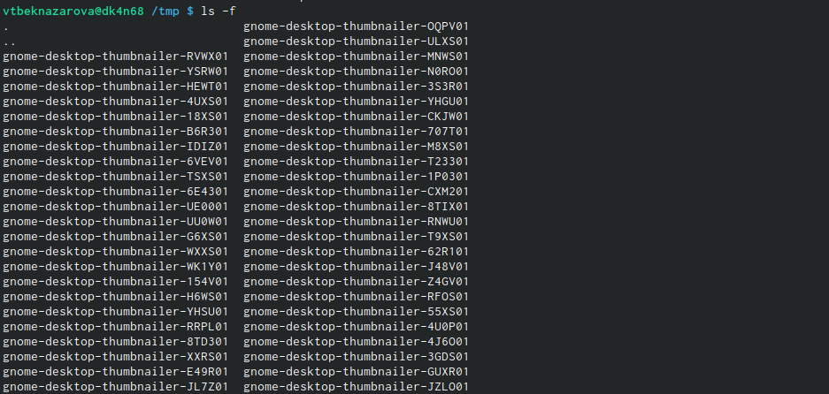{#fig:005 width=90%}

##

В каталоге /var/spool есть подкаталог с именем cron 

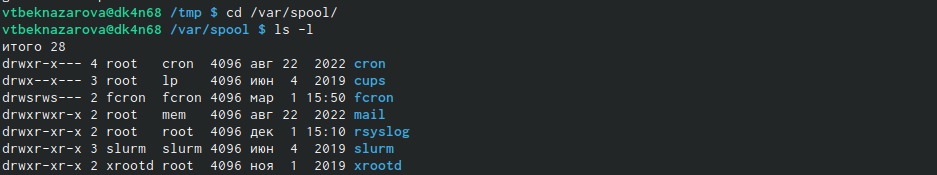{#fig:006 width=90%}

##

Перейдем в наш домашний каталог и выведем на экран его содержимое. Определили, кто является владельцем файлов и подкаталогов при помощи команды ls -al. Большинство файлов принадлежат мне и пользователю root. 

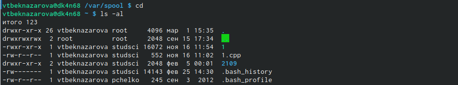{#fig:007 width=90%}

##

3.  3.1. В домашнем каталоге создаем новый каталог с именем newdir.
3.2. В каталоге ~/newdir создаем новый каталог с именем morefun.
3.3. В домашнем каталоге создем одной командой три новых каталога с именами
letters, memos, misk. Затем удаляем эти каталоги одной командой.
3.4. Попробуем удалить ранее созданный каталог ~/newdir командой rm. Проверем
был ли каталог удалён.
3.5. Удалим каталог ~/newdir/morefun из домашнего каталога. Проверим, был ли
каталог удалён.

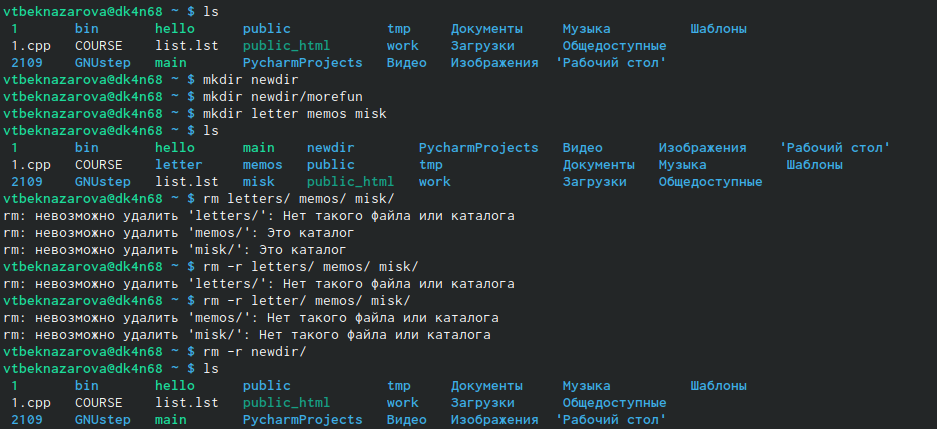{#fig:008 width=90%}

##

4. С помощью команды man определим, какую опцию команды ls нужно использо-
вать для просмотра содержимое не только указанного каталога, но и подкаталогов,
входящих в него.Нам нужен ключ -R

##

5. С помощью команды man определим набор опций команды ls, позволяющий отсорти-
ровать по времени последнего изменения выводимый список содержимого каталога
с развёрнутым описанием файлов.

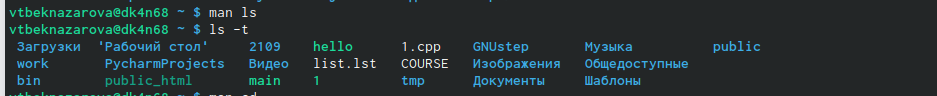{#fig:009 width=90%}

##

6. Используем команду man для просмотра описания следующих команд: cd, pwd, mkdir,
rmdir, rm. 

{#fig:009 width=90%}

##

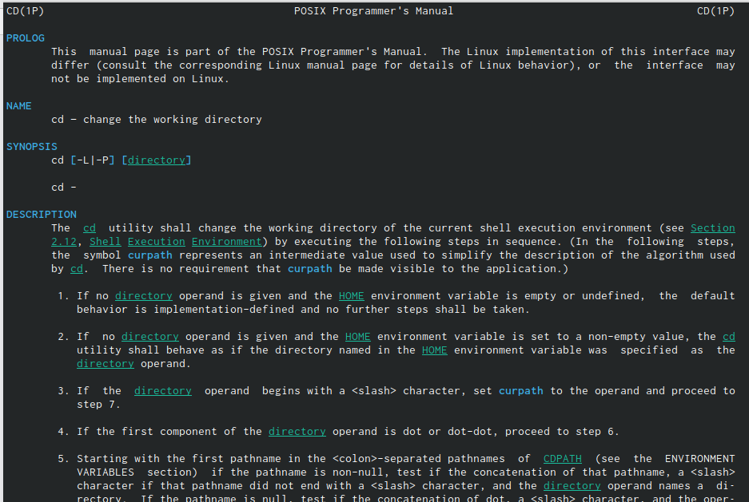{#fig:011 width=90%}

##

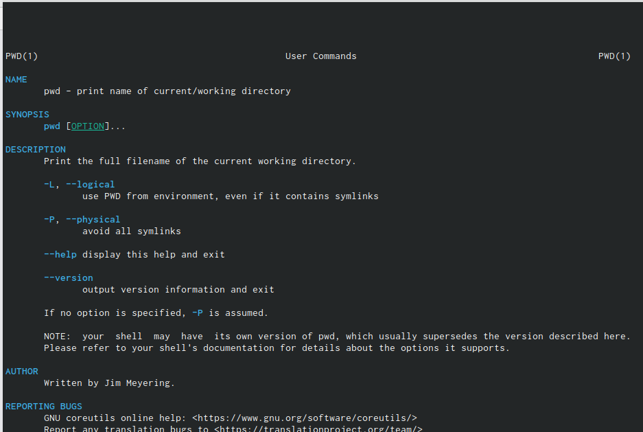{#fig:012 width=90%}

##

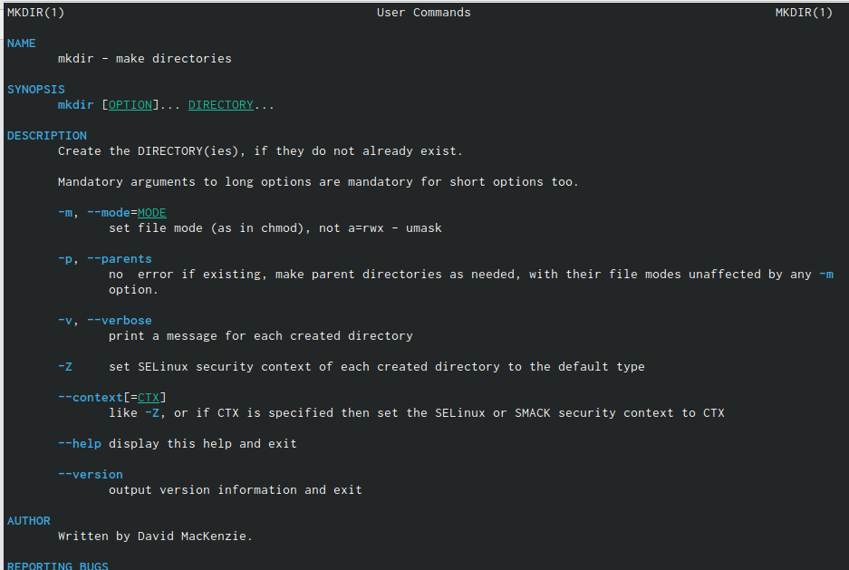{#fig:013 width=90%}

##

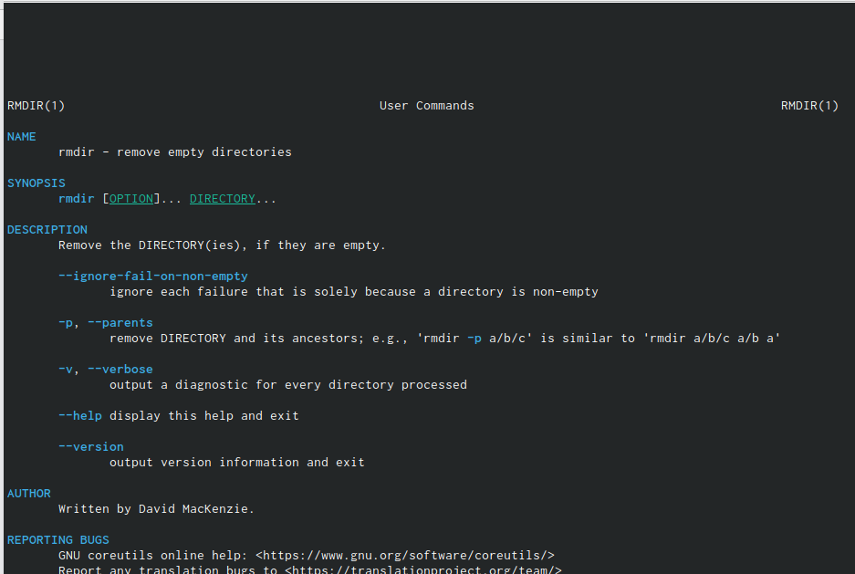{#fig:014 width=90%}

##

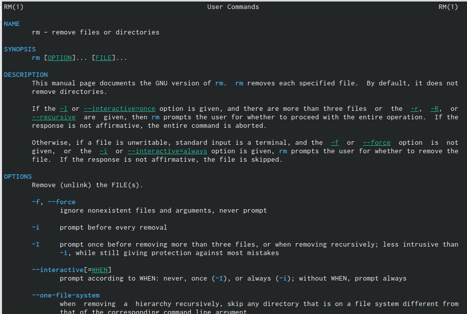{#fig:0125 width=90%}

##

7. Используя информацию, полученную при помощи команды history, выполниv модификацию и исполнение нескольких команд из буфера команд.

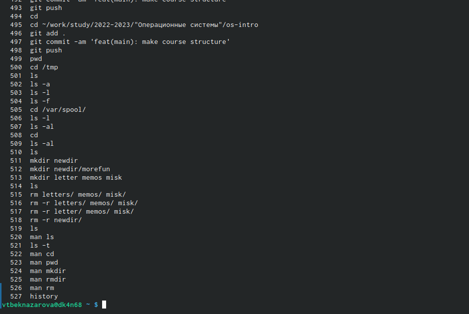{#fig:016 width=90%}

## Результаты

Мы приобрели практические навыки взаимодействия пользователя с системой посредством командной строки.

