---
## Front matter
title: "Отчет по лабораторной работе №4"
subtitle: "Основы интерфейса взаимодействия пользователя с системой Unix на уровне командной строки"
author: "Бекназарова Виктория Тиграновна"

## Generic otions
lang: ru-RU
toc-title: "Содержание"

## Bibliography
bibliography: bib/cite.bib
csl: pandoc/csl/gost-r-7-0-5-2008-numeric.csl

## Pdf output format
toc: true # Table of contents
toc-depth: 2
lof: true # List of figures
lot: true # List of tables
fontsize: 12pt
linestretch: 1.5
papersize: a4
documentclass: scrreprt
## I18n polyglossia
polyglossia-lang:
  name: russian
  options:
	- spelling=modern
	- babelshorthands=true
polyglossia-otherlangs:
  name: english
## I18n babel
babel-lang: russian
babel-otherlangs: english
## Fonts
mainfont: PT Serif
romanfont: PT Serif
sansfont: PT Sans
monofont: PT Mono
mainfontoptions: Ligatures=TeX
romanfontoptions: Ligatures=TeX
sansfontoptions: Ligatures=TeX,Scale=MatchLowercase
monofontoptions: Scale=MatchLowercase,Scale=0.9
## Biblatex
biblatex: true
biblio-style: "gost-numeric"
biblatexoptions:
  - parentracker=true
  - backend=biber
  - hyperref=auto
  - language=auto
  - autolang=other*
  - citestyle=gost-numeric
## Pandoc-crossref LaTeX customization
figureTitle: "Рис."
tableTitle: "Таблица"
listingTitle: "Листинг"
lofTitle: "Список иллюстраций"
lotTitle: "Список таблиц"
lolTitle: "Листинги"
## Misc options
indent: true
header-includes:
  - \usepackage{indentfirst}
  - \usepackage{float} # keep figures where there are in the text
  - \floatplacement{figure}{H} # keep figures where there are in the text
---

# Цель работы

Приобретение практических навыков взаимодействия пользователя с системой по-
средством командной строки.

# Выполнение лабораторной работы

1. Определим полное имя нашего домашнего каталога. Далее относительно этого ката-
лога будем выполняться последующие упражнения. (рис. @fig:001).

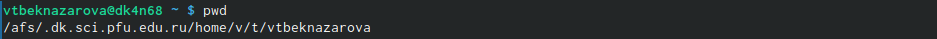{#fig:001 width=90%}

2. Перейдем в каталог /tmp.Выведем на экран содержимое каталога /tmp. Для этого используем команду ls с различными опциями. (рис. @fig:002).

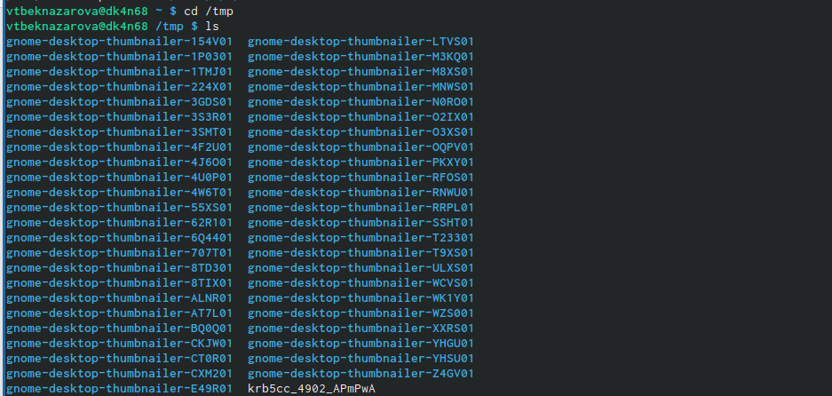{#fig:002 width=90%}

 Мы можем увидеть содержимое каталога со скрытыми файлами при помощи опции -а  (рис. @fig:003).

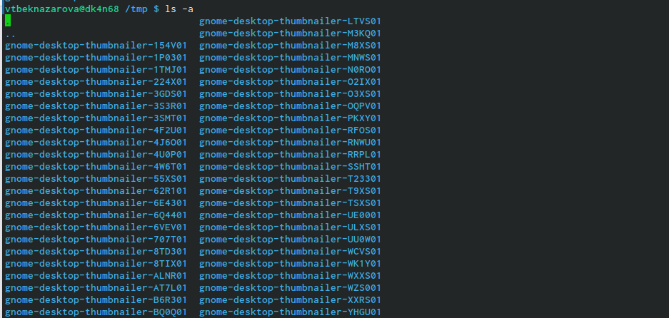{#fig:003 width=90%}

При помощи опции -l, мы можем увидеть подробное содержимое каталога.  (рис. @fig:004)

 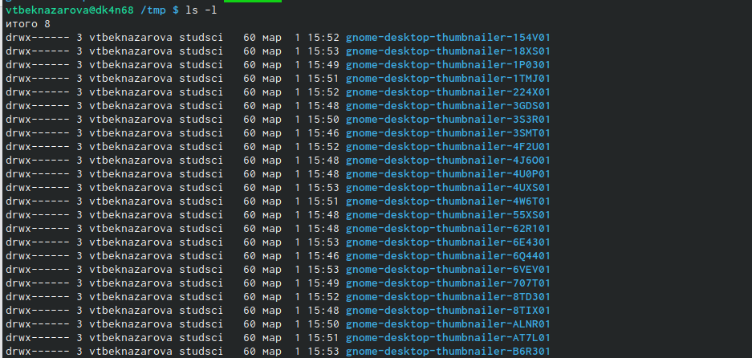{#fig:004 width=90%} 

При помощи опции -f можем увидеть файлы списком (рис. @fig:005)

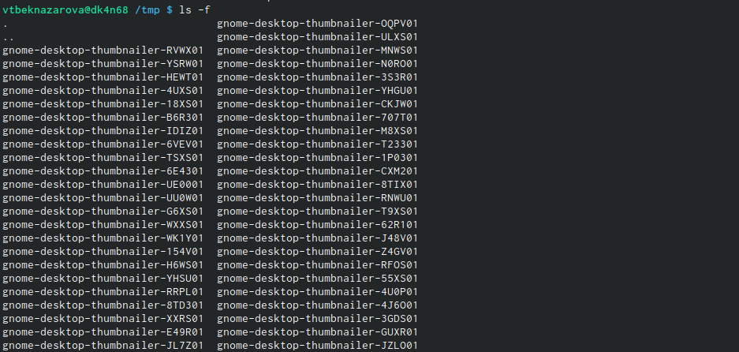{#fig:005 width=90%}

В каталоге /var/spool есть подкаталог с именем cron (рис. @fig:006)

{#fig:006 width=90%}

Перейдем в наш домашний каталог и выведем на экран его содержимое. Определили, кто является владельцем файлов и подкаталогов при помощи команды ls -al. Большинство файлов принадлежат мне и пользователю root. (рис. @fig:007)

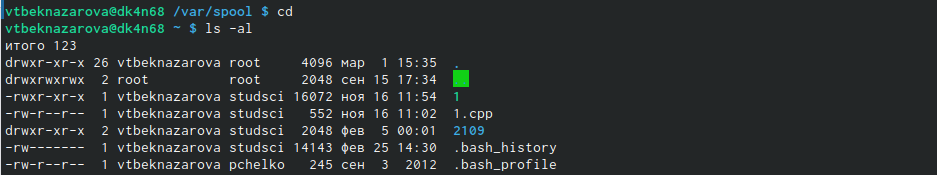{#fig:007 width=90%}

3.  3.1. В домашнем каталоге создаем новый каталог с именем newdir.
3.2. В каталоге ~/newdir создаем новый каталог с именем morefun.
3.3. В домашнем каталоге создем одной командой три новых каталога с именами
letters, memos, misk. Затем удаляем эти каталоги одной командой.
3.4. Попробуем удалить ранее созданный каталог ~/newdir командой rm. Проверем
был ли каталог удалён.
3.5. Удалим каталог ~/newdir/morefun из домашнего каталога. Проверим, был ли
каталог удалён.(рис. @fig:008)

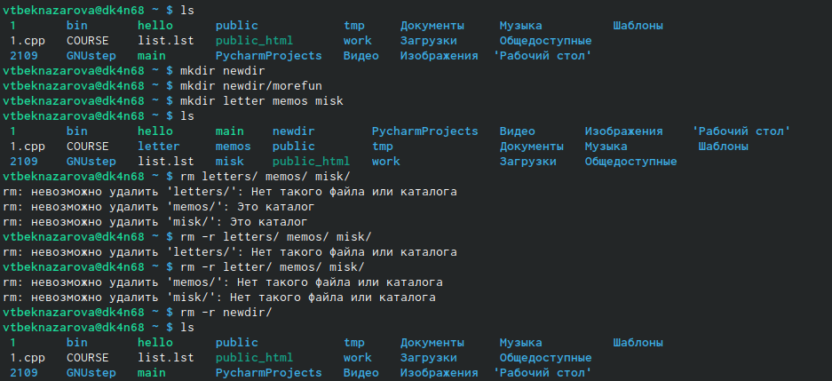{#fig:008 width=90%}

4. С помощью команды man определим, какую опцию команды ls нужно использо-
вать для просмотра содержимое не только указанного каталога, но и подкаталогов,
входящих в него.Нам нужен ключ -R

5. С помощью команды man определим набор опций команды ls, позволяющий отсорти-
ровать по времени последнего изменения выводимый список содержимого каталога
с развёрнутым описанием файлов.(рис. @fig:009)

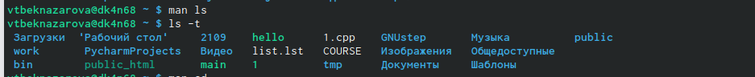{#fig:009 width=90%}

6. Используем команду man для просмотра описания следующих команд: cd, pwd, mkdir,
rmdir, rm. (рис. @fig:010) (рис. @fig:011) (рис. @fig:012) (рис. @fig:013) (рис. @fig:014)

{#fig:009 width=90%}

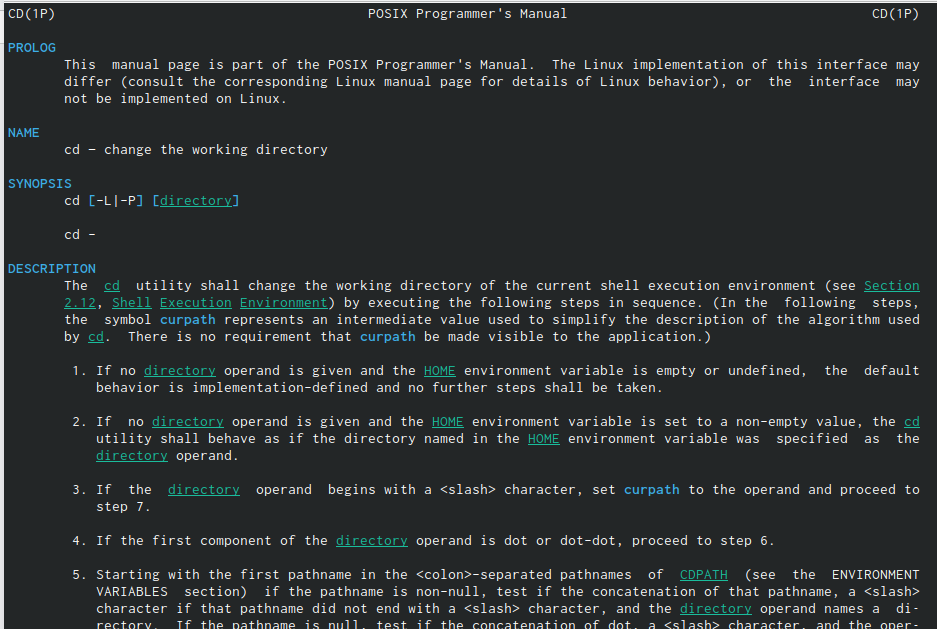{#fig:011 width=90%}

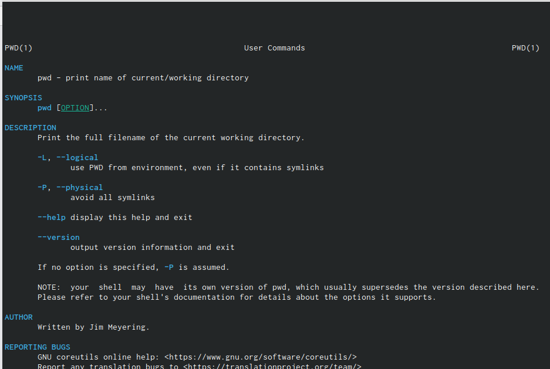{#fig:012 width=90%}

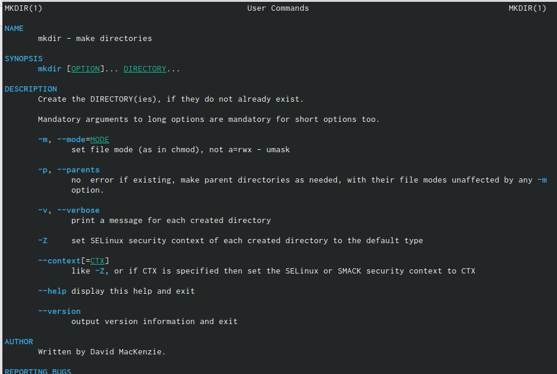{#fig:013 width=90%}

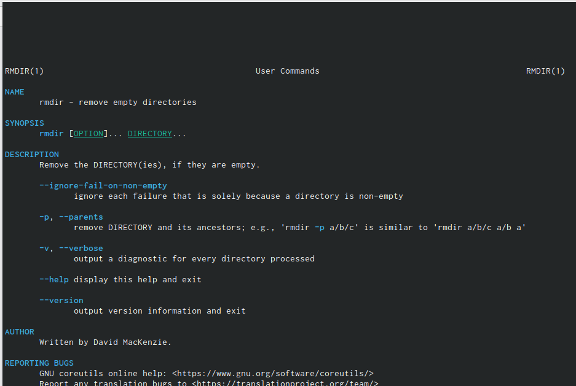{#fig:014 width=90%}

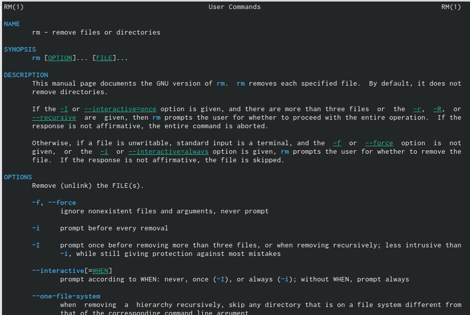{#fig:0125 width=90%}

7. Используя информацию, полученную при помощи команды history, выполниv модификацию и исполнение нескольких команд из буфера команд.(рис. @fig:016)

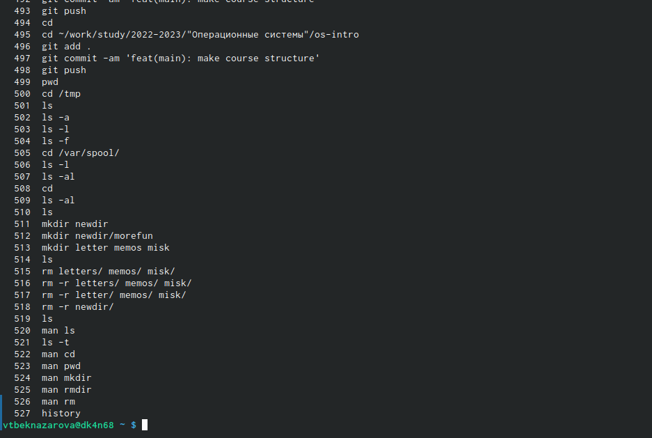{#fig:016 width=90%}

# Вывод

Мы приобрели практические навыки взаимодействия пользователя с системой посредством командной строки.

# Контрольные вопросы

1.	Что такое командная строка?
Ответ: текстовый интерфейс взаимодействия пользователя с системой

2.	При помощи какой команды можно определить абсолютный путь текущего каталога? Приведите пример.
Ответ: команда pwd, пример:
-	cd /var/www
-	pwd
-	/var/www/

3.	При помощи какой команды и каких опций можно определить только тип файлов и их имена в текущем каталоге? Приведите примеры.
Ответ: команда ls с опцией -F.

4.	Какие файлы считаются скрытыми? Как получить информацию о скрытых файлах? Приведите примеры.
Ответ: Некоторые файлы в операционной системе скрыты от просмотра и обычно используются для настройки рабочей среды. Имена таких файлов начинаются с точки. информацию о них можно получить с помощью команды ls с опцией -a.

5.	При помощи каких команд можно удалить файл и каталог? Можно ли это сделать одной и той же командой?
Ответ: С помощью команды rm можно удалить как отдельный файл так и целый каталог, в случае каталога необходимо указать опцию -r.

6.	Как определить, какие команды выполнил пользователь в сеансе работы? Ответ: с помощью команды history.

7.	Каким образом можно исправить и запустить на выполнение команду, которую пользователь уже использовал в сеансе работы? Приведите примеры Ответ: узнать порядковый номер этой команды с помощью history
затем изменить её сл. образом:
!<номер_команды>:s/<что_меняем>/<на_что_меняем>

8.	Можно ли в одной строке записать несколько команд? Если да, то как? Приведите примеры 

Ответ: да, можно, необходимо разделить команды символом точки с запятой в таком случае они будут выполняться последовательно в том порядке, в котором они записаны пример: cd /tmp/; ls -l;pwd

9.	Что такое символ экранирования? Приведите примеры использования этого символа.
Ответ: символ экранирования \ (обратный слэш) - символ, экранирующие управляющие конструкции и символы в названии файлов и папок Пример: ls /etc/nginx

10.	Какая информация выводится на экран о файлах и каталогах, если используется опция l в команде ls?
Ответ: тип файла, право доступа, число ссылок, владелец, размер, дата последней ревизии, имя файла или каталога.

11.	Что такое относительный путь к файлу? Приведите примеры использования относительного и абсолютного пути при выполнении какой-либо команды. 
Ответ: относительный путь - путь к тому или иному файлу или директории относительной текущей рабочей директории, пример:
папка /www/ в директории /var/ абсолютный путь: /var/www/
относительный путь(если рабочая директория - /var/): /www/

12.	Как получить информацию об интересующей вас команде?
Ответ: можно попробовать найти информацию по использованию с помощью утилиты man, или попробовать ввести опцию --help.

13.	Какая клавиша или комбинация клавиш служит для автоматического дополнения вводимых команд?
Ответ: клавиша Tab.

# Список литературы{.unnumbered}

::: {#refs}
:::
