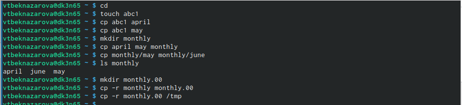
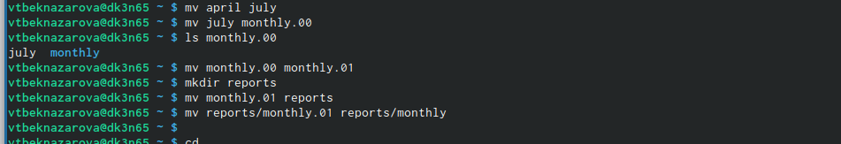
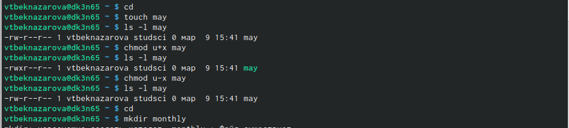
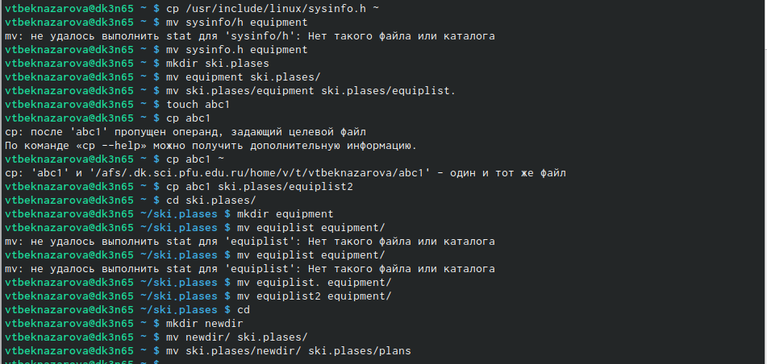
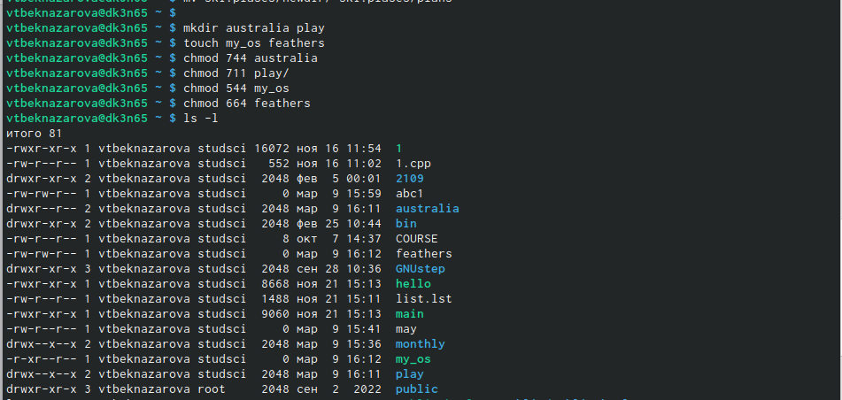
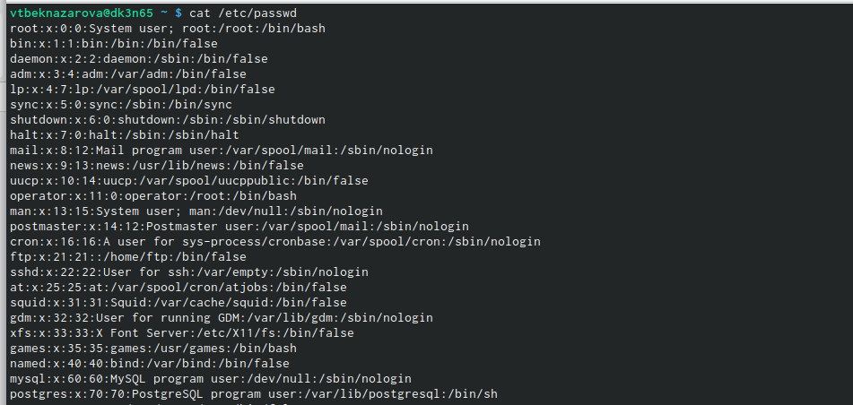
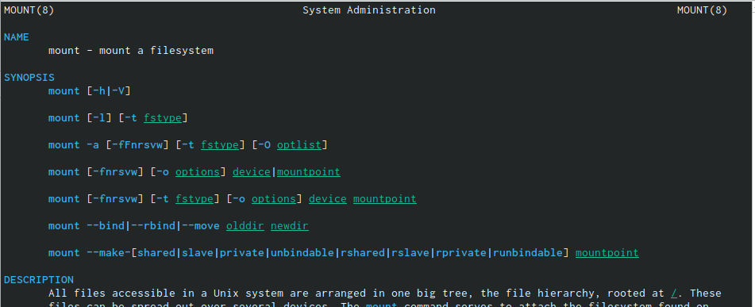
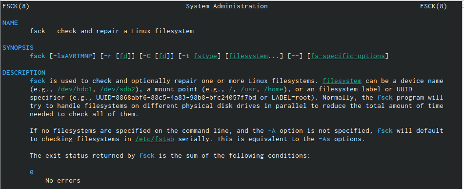
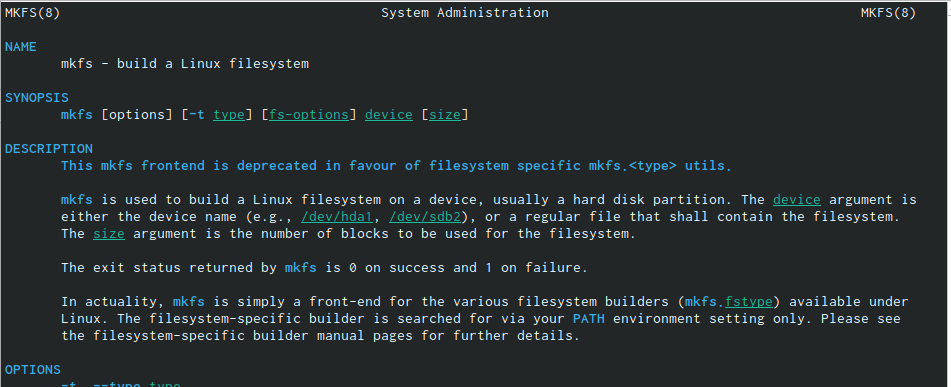
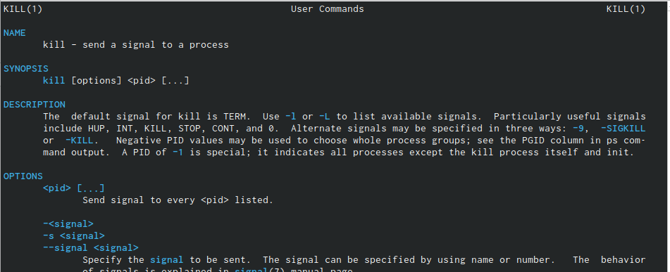

---
## Front matter
lang: ru-RU
title: Лабораторная работа № 5
subtitle: Операционные системы
author:
  - Бекназарова Виктория Тиграновна
institute:
  - Российский университет дружбы народов, Москва, Россия
  
date: 10 марта 2023

## i18n babel
babel-lang: russian
babel-otherlangs: english

## Formatting pdf
toc: false
toc-title: Содержание
slide_level: 2
aspectratio: 169
section-titles: true
theme: metropolis
header-includes:
 - \metroset{progressbar=frametitle,sectionpage=progressbar,numbering=fraction}
 - '\makeatletter'
 - '\beamer@ignorenonframefalse'
 - '\makeatother'
---

## Цели и задачи

Ознакомление с файловой системой Linux, её структурой, именами и содержанием
каталогов. Приобретение практических навыков по применению команд для работы
с файлами и каталогами, по управлению процессами (и работами), по проверке исполь-
зования диска и обслуживанию файловой системы.

## Содержание исследования

1. Выполним все примеры, приведённые в первой части описания лабораторной работы. 

{#fig:001 width=95%}

##

{#fig:002 width=95%}

##

{#fig:003 width=95%}

##

2. Скопируем файл /usr/include/sys/io.h в домашний каталог и назовите его
equipment.Такого файла нет,взяли другой. 
В домашнем каталоге создаем директорию ~/ski.plases. Переместим файл equipment в каталог ~/ski.plases.Переименуем файл ~/ski.plases/equipment в ~/ski.plases/equiplist.Создаем в домашнем каталоге файл abc1 и скопируем его в каталог ~/ski.plases, назовем его equiplist2. Создаем каталог с именем equipment в каталоге ~/ski.plases. Переместим файлы ~/ski.plases/equiplist и equiplist2 в каталог ~/ski.plases/equipment. Создаем и переместим каталог ~/newdir в каталог ~/ski.plases и назовем его plans. 

{#fig:004 width=95%}

##

3. Определим опции команды chmod, необходимые для того, чтобы присвоить перечис-
ленным ниже файлам выделенные права доступа, считая, что в начале таких прав 
нет:
(drwxr--r--) australia
( drwx--x--x) play
(-r-xr--r-- ) my_os
(-rw-rw-r--) feathers

{#fig:005 width=95%}

##

4. Просмотрим содержимое файла /etc/password 

{#fig:006 width=95%}

##

5. Скопируем файл ~/feathers в файл ~/file.old. Переместим файл ~/file.old в каталог ~/play. Скопируем каталог ~/play в каталог ~/fun. Переместим каталог ~/fun в каталог ~/play и назовем его games. Лишим владельца файла ~/feathers права на чтение..  Дайдим владельцу файла ~/feathers право на чтение.. Лишим владельца каталога ~/play права на выполнение. Перейдите в каталог ~/play. Дайте владельцу каталога ~/play право на выполнение.

{#fig:007 width=95%}

##

6. Прочитаем man по командам mount, fsck, mkfs, kill. 

{#fig:008 width=95%}

##

{#fig:009 width=95%}

##

{#fig:010 width=95%}

##

{#fig:011 width=95%}

## Результаты

В ходе данной работы мы ознакомились с файловой системой Linux, её структурой, именами и содержанием каталогов. Научились совершать базовые операции с файлами, управлять правами их доступа для пользователя и групп. Ознакомились с Анализом файловой системы. А также получили базовые навыки по проверке использования диска и обслуживанию файловой системы.

