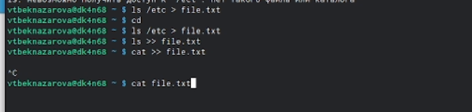
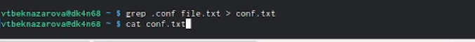
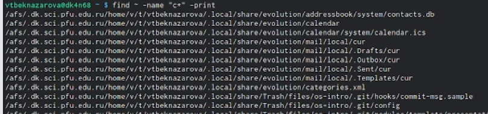
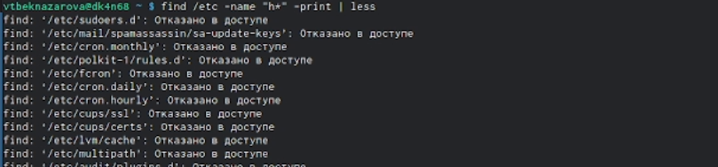
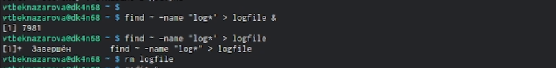
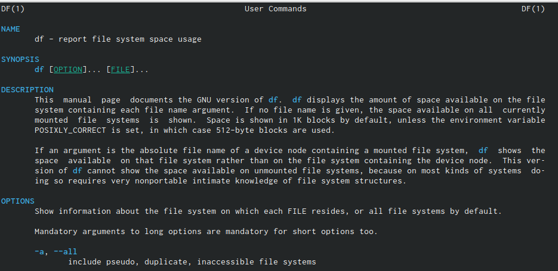
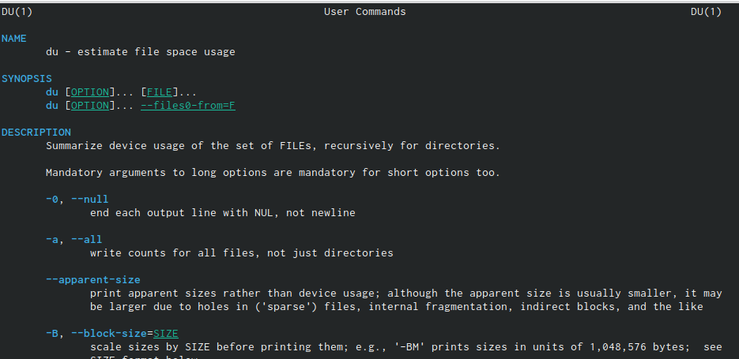
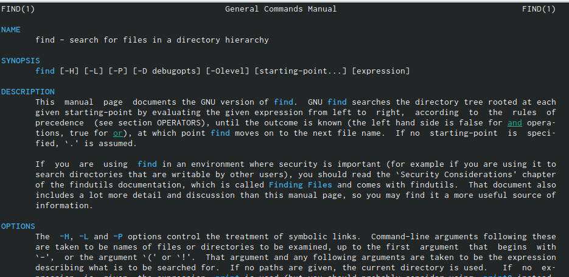
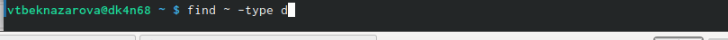
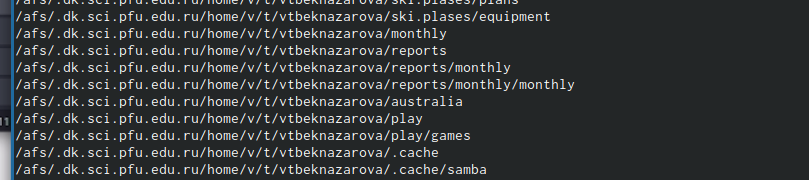

---
## Front matter
lang: ru-RU
title: Лабораторная работа № 6
subtitle: Поиск файлов. Перенаправление ввода-вывода. Просмотр запущенных процессов
author:
  - Бекназарова Виктория Тиграновна
institute:
  - Российский университет дружбы народов, Москва, Россия
  
date: 15 марта 2023

## i18n babel
babel-lang: russian
babel-otherlangs: english

## Formatting pdf
toc: false
toc-title: Содержание
slide_level: 2
aspectratio: 169
section-titles: true
theme: metropolis
header-includes:
 - \metroset{progressbar=frametitle,sectionpage=progressbar,numbering=fraction}
 - '\makeatletter'
 - '\beamer@ignorenonframefalse'
 - '\makeatother'
---


## Цели и задачи

Ознакомление с инструментами поиска файлов и фильтрации текстовых данных.
Приобретение практических навыков: по управлению процессами (и заданиями), по
проверке использования диска и обслуживанию файловых систем.


## Содержание исследования

1. Осуществляем вход в систему, используя соответствующее имя пользователя.
2. Запишем в файл file.txt названия файлов, содержащихся в каталоге /etc. Допишем в этот же файл названия файлов, содержащихся в нашем домашнем каталоге. 


{#fig:001 width=95%}


##


3. Выведем имена всех файлов из file.txt, имеющих расширение .conf, после чего
запишите их в новый текстовой файл conf.txt. 


{#fig:001 width=95%}


##


4. Определили, какие файлы в нашем домашнем каталоге имеют имена, начинавшиеся с символа c? 


{ #fig:003 height=70% width=70% }


##


5. Выведем на экран (постранично) имена файлов из каталога /etc, начинающиеся с символа h.


```
find /etc -name "h*" -print | less 
```


{ #fig:004 height=70% width=70% }


##


6. Запустили в фоновом режиме процесс, который будет записывать в 
файл ~/logfile файлы, имена которых начинаются с log. 
Процесс выполнен


##


7. Удалили файл ~/logfile. Но сначала убили процесс в нем. 


{ #fig:005 height=70% width=70% }


##


8. Запустили из консоли в фоновом режиме редактор gedit. 


9. Определили идентификатор процесса gedit, используя команду ps, конвейер и фильтр grep


10. Прочитали справку (man) команды kill, после чего используйте её для завершения процесса gedit. 


{ #fig:006 height=70% width=70% }


##


11. Выполним команды df и du, предварительно получив более подробную информацию об этих командах, с помощью команды man. .


{ #fig:007 height=70% width=70% }


##


{ #fig:008 height=70% width=70% }


##


{ #fig:009 height=70% width=70% }


##


12.	Воспользовавшись справкой команды find, вывести имена всех директорий, имеющихся в нашем домашнем каталоге.

```
find ~ -type d
```

{ #fig:010 height=70% width=70% }


##


{ #fig:011 height=70% width=70% }


## Результаты


В данной работе мы ознакомились с инструментами поиска файлов и фильтрации текстовых данных. А также приобрели практические навыки по управлению процессами. 


