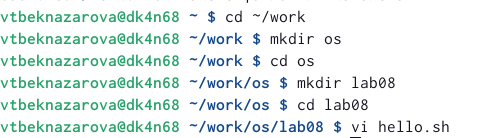
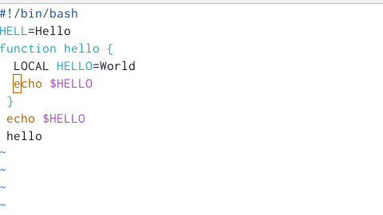
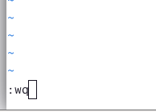
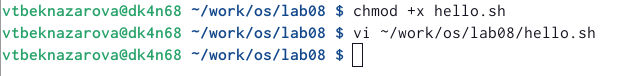
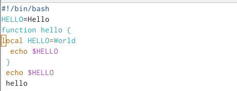
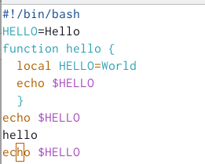
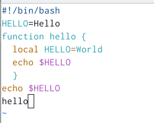
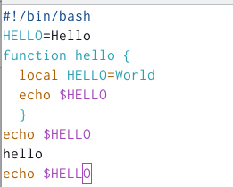
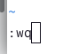

---
## Front matter
lang: ru-RU
title: "Лабораторная работа №8"
subtitle: "Текстовой редактор vi"
author:
  - Бекназарова Виктория Тиграновна
institute:
  - Российский университет дружбы народов, Москва, Россия
date: 29 марта 2023

## i18n babel
babel-lang: russian
babel-otherlangs: english

## Formatting pdf
toc: false
toc-title: Содержание
slide_level: 2
aspectratio: 169
section-titles: true
theme: metropolis
header-includes:
 - \metroset{progressbar=frametitle,sectionpage=progressbar,numbering=fraction}
 - '\makeatletter'
 - '\beamer@ignorenonframefalse'
 - '\makeatother'
---

## Цели и задачи

Познакомиться с операционной системой Linux. Получить практические навыки работы с редактором vi, установленным по умолчанию практически во всех дистрибутивах.

## Содержание исследования

1. Создадим каталог с именем ~/work/os/lab08.Перейдем во вновь созданный каталог. Вызовем vi и создадим файл hello.sh 

##

{#fig:001 width=90%}

##

2. Нажмем клавишу i и введем следующий текст.

##

{#fig:002 width=90%}

##

3. Нажмем клавишу Esc для перехода в командный режим после завершения ввода
текста. Нажмем : для перехода в режим последней строки и внизу вашего экрана появится
приглашение в виде двоеточия.Нажмем w (записать) и q (выйти), а затем нажмите клавишу Enter для сохранения нашего текста и завершения работы.

##

{#fig:003 width=90%}

##

4. Cделаем файл исполняемым.Вызовем vi на редактирование файла

##

{#fig:004 width=90%}

##

5. Установим курсор в конец слова HELL второй строки.Перейдем в режим вставки и заменим на HELLO. Нажмите Esc для возврата в командный режим

##

{#fig:005 width=90%}

##

6. Установим курсор на четвертую строку и сотрем слово LOCAL. Перейдем в режим вставки и наберем следующий текст: local, нажмем Esc для возврата в командный режим.

##

{#fig:006 width=90%}

##

7. Установим курсор на последней строке файла. Вставим после неё строку, содержащую следующий текст: echo $HELLO.Нажмем Esc для перехода в командный режим.

##

{#fig:007 width=90%}

##

8. Удалим последнюю строку.

##

{#fig:008 width=90%}

##

9. Введем команду отмены изменений u для отмены последней команды

##

{#fig:009 width=90%}

##

10. Введем символ : для перехода в режим последней строки. Запишем произведённые
изменения и выйдите из vi

##

{#fig:010 width=90%}

## Результаты

В ходе роботы мы  познакомились с операционной системой Linux, и получили практические навыки работы с редактором vi, установленным по умолчанию практически во всех дистрибутивах UNIX. А также освоили основные режимы и команды

