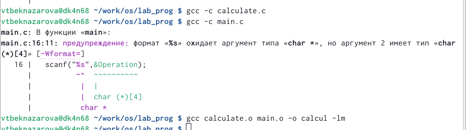

---
## Front matter
title: "Лабораторная работа №13"
subtitle: "Средства, применяемые при разработке программного обеспечения в ОС типа UNIX/Linux"
author: "Бекназарова Виктория Тиграновна"


## Generic otions
lang: ru-RU
toc-title: "Содержание"

## Bibliography
bibliography: bib/cite.bib
csl: pandoc/csl/gost-r-7-0-5-2008-numeric.csl

## Pdf output format
toc: true # Table of contents
toc-depth: 2
lof: true # List of figures
lot: true # List of tables
fontsize: 12pt
linestretch: 1.5
papersize: a4
documentclass: scrreprt
## I18n polyglossia
polyglossia-lang:
  name: russian
  options:
	- spelling=modern
	- babelshorthands=true
polyglossia-otherlangs:
  name: english
## I18n babel
babel-lang: russian
babel-otherlangs: english
## Fonts
mainfont: PT Serif
romanfont: PT Serif
sansfont: PT Sans
monofont: PT Mono
mainfontoptions: Ligatures=TeX
romanfontoptions: Ligatures=TeX
sansfontoptions: Ligatures=TeX,Scale=MatchLowercase
monofontoptions: Scale=MatchLowercase,Scale=0.9
## Biblatex
biblatex: true
biblio-style: "gost-numeric"
biblatexoptions:
  - parentracker=true
  - backend=biber
  - hyperref=auto
  - language=auto
  - autolang=other*
  - citestyle=gost-numeric
## Pandoc-crossref LaTeX customization
figureTitle: "Рис."
tableTitle: "Таблица"
listingTitle: "Листинг"
lofTitle: "Список иллюстраций"
lotTitle: "Список таблиц"
lolTitle: "Листинги"
## Misc options
indent: true
header-includes:
  - \usepackage{indentfirst}
  - \usepackage{float} # keep figures where there are in the text
  - \floatplacement{figure}{H} # keep figures where there are in the text
---

# Цель работы

Приобретем простейшие навыки разработки, анализа, тестирования и отладки приложений в ОС типа UNIX/Linux на примере создания на языке программирования С калькулятора с простейшими функциями


# Выполнение лабораторной работы

1. В домашнем каталоге создаем подкаталог ~/work/os/lab_prog.(рис. @fig:001).

{#fig:001 width=70%}


2. Создаем в нём файлы: calculate.h, calculate.c, main.c.
Это будет примитивнейший калькулятор, способный складывать, вычитать, умножать
и делить, возводить число в степень, брать квадратный корень, вычислять sin, cos, tan.
При запуске он будет запрашивать первое число, операцию, второе число. После этого
программа выведет результат и остановится.(рис. @fig:002).(рис. @fig:003)(рис. @fig:004)(рис. @fig:005)

{#fig:002 width=70%}


{#fig:003 width=70%}


{#fig:004 width=70%}


{#fig:005 width=70%}


3. Выполним компиляцию программы посредством gcc(рис. @fig:006)


{#fig:006 width=70%}


4. Создадим Makefile и с помощью gdb выполним отладку программы calcul (рис. @fig:007)


{#fig:007 width=70%}


5. С помощью утилиты splint попробуйте проанализировать коды файлов calculate.c
и main.c.(рис. @fig:008)

{#fig:008 width=70%}


# Выводы

Я приобрела простейшие навыки разработки, анализа, тестирования и отладки приложений в ОС типа UNIX/Linux на примере создания на языке программирования С калькулятора с простейшими функциями

# Контрольные вопросы

1. Как получить информацию о возможностях программ gcc, make, gdb и др.? 
Ответ: Для этого есть команда man и предлагающиеся к ней файлы. 

2. Назовите и дайте краткую характеристику основным этапам разработки прило- жений в UNIX. 
Ответ: Кодировка, Компиляция, Тест. 

3. Что такое суффикс в контексте языка программирования? Приведите примеры использования. 
Ответ: Это расширения файлов. 

4. Каково основное назначение компилятора языка С в UNIX? 
Ответ: Программа gcc, которая интерпретирует к определенному языку программирования аргументы командной строки и определяет запуск нужного компилятора для нужного файла. 

5. Для чего предназначена утилита make? 
Ответ: Для компиляции группы файлов. Собрания из них программы, и последующего удаления. 

6. Приведите пример структуры Makefile. Дайте характеристику основным элементам этого файла. 
Ответ: 
```
program: main.o lib.o  
cc -o program main.o lib.o  
main.o lib.o: defines.h 
```
В имени второй цели указаны два файла и для этой же цели не указана команда компиляции. Кроме того, нигде явно неуказана зависимость объектных файлов от «*.c»-файлов. Дело в том, что программа make имеет предопределённые правила для получения файлов с определёнными расширениями. Так, для цели-объектного файла (расширение «.o») при обнаружении соответствующего файла с расширением «.c» будет вызван компилятор «сс -с» с указанием в параметрах этого «.c»-файла и всех файлов-зависимостей. 

7. Назовите основное свойство, присущее всем программам отладки. Что необходимо сделать, чтобы его можно было использовать? 
Ответ: Программы для отладки нужны для нахождения ошибок в программе. Для их использования надо скомпилировать программу таким образом, чтобы отладочная информация содержалась в конечном бинарном файле. 

8. Назовите и дайте основную характеристику основным командам отладчика gdb. 
Ответ: 

backtrace – выводит весь путь к текущей точке останова, то есть названия всех функций, начиная от main(); иными словами, выводит весь стек функций; 

break – устанавливает точку останова; параметром может быть номер строки или название функции; 

clear – удаляет все точки останова на текущем уровне стека (то есть в текущей функции); 

continue – продолжает выполнение программы от текущей точки до конца; 

delete – удаляет точку останова или контрольное выражение; 

display – добавляет выражение в список выражений, значения которых отображаются каждый раз при остановке программы; 

finish – выполняет программу до выхода из текущей функции; отображает возвращаемое значение,если такое имеется; 

info breakpoints – выводит список всех имеющихся точек останова; 

info watchpoints – выводит список всех имеющихся контрольных выражений; 

list – выводит исходный код; в качестве параметра передаются название файла исходного кода, затем, через двоеточие, номер начальной и конечной строки; 

next – пошаговое выполнение программы, но, в отличие от команды step, не выполняет пошагово вызываемые функции; 

print – выводит значение какого-либо выражения (выражение передаётся в качестве параметра); 

run – запускает программу на выполнение; 

set – устанавливает новое значение переменной 

step – пошаговое выполнение программы; 

watch – устанавливает контрольное выражение, программа остановится, как только значение контрольного выражения изменится; 
 
9. Опишите по шагам схему отладки программы, которую Вы использовали при выполнении лабораторной работы. 
Ответ: 
1. gdb --silent ./calcul 
2. run 
3. list 
4. backtrace 
5. breakpoints 
6. print Numeral 
7. Splint (Не использовался по причине отсутствия команды в консоли). 

10. Прокомментируйте реакцию компилятора на синтаксические ошибки в программе при его первом запуске. 
Ответ: Консоль выводит ошибку с номером строки и ошибочным сегментом, но при этом есть возможность выполнить программу сразу. 

11. Назовите основные средства, повышающие понимание исходного кода программы. 
Ответ: 
 a) Правильный синтаксис 
b) Наличие комментариев 
c) Разбиение большой сложной программы на несколько сегментов попроще. 

12. Каковы основные задачи, решаемые программой splint? 
Ответ: split – разбиение файла на меньшие, определённого размера. Может разбивать текстовые файлы по строкам и любые – по байтам. По умолчанию читает со стандартного ввода и создает файлы с именами вида xaa, xab и т.д. По умолчанию разбиение идёт по 1000 строк в файле. 

