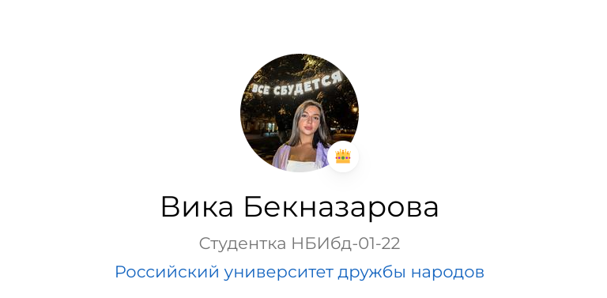
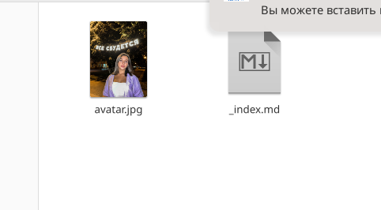
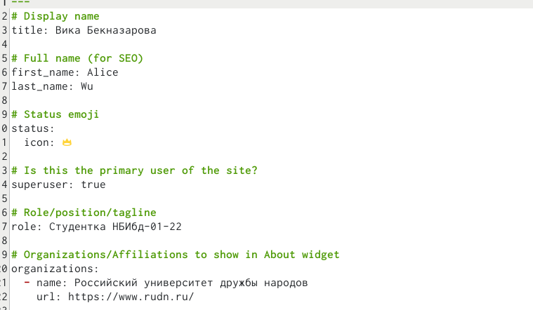
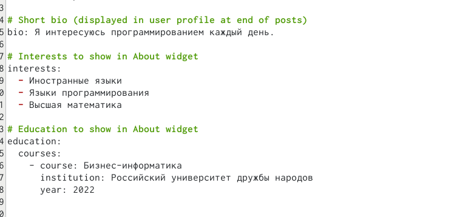
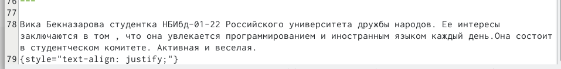
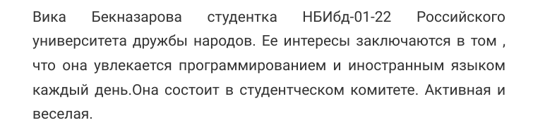
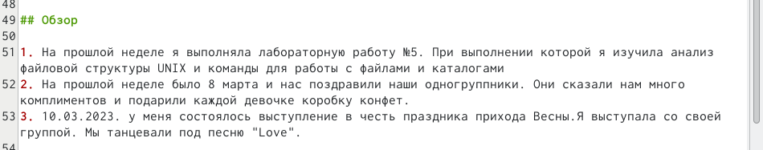
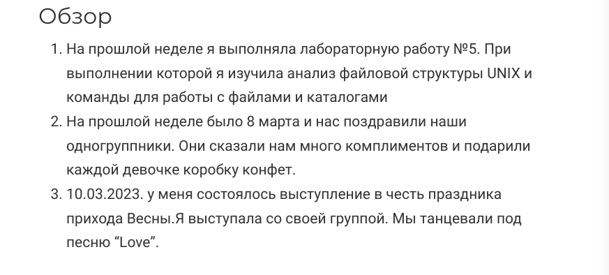
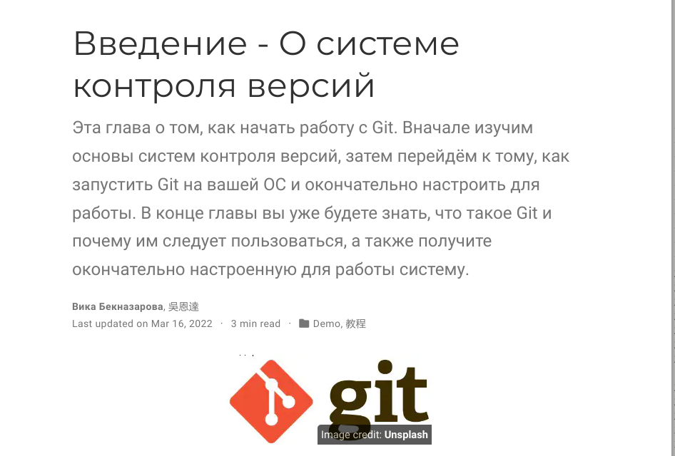
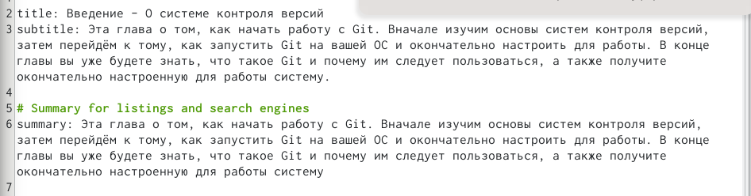

---
## Front matter
lang: ru-RU
title: Индивидуальный проект
subtitle: Второй этап
author:
  - Бекназарова Виктория Тиграновна
institute:
  - Российский университет дружбы народов, Москва, Россия

date: 17 марта 2023

## i18n babel
babel-lang: russian
babel-otherlangs: english

## Formatting pdf
toc: false
toc-title: Содержание
slide_level: 2
aspectratio: 169
section-titles: true
theme: metropolis
header-includes:
 - \metroset{progressbar=frametitle,sectionpage=progressbar,numbering=fraction}
 - '\makeatletter'
 - '\beamer@ignorenonframefalse'
 - '\makeatother'
---

## Цели и задачи

Добавит к сайту данные о себе.

## Содержание исследования

1. Размещаем фотографию владельца сайта,краткое описание владельца сайта, информацию об интересах и образовании 

{#fig:001 width=90%}

##

{#fig:002 width=90%}

##

{#fig:003 width=90%}

##

{#fig:004 width=90%}

##

{#fig:005 width=90%}

##

{#fig:006 width=90%}

##

{#fig:007 width=90%}

##

2. Делаем пост по прошедшей неделе 

{#fig:008 width=90%}

##

{#fig:009 width=90%}

##

3. Делаем пост на тему " Управление версиями. Git." 

{#fig:010 width=90%}

##

{#fig:011 width=90%}

## Результаты

Мы внесли изменения в личный сайт.

