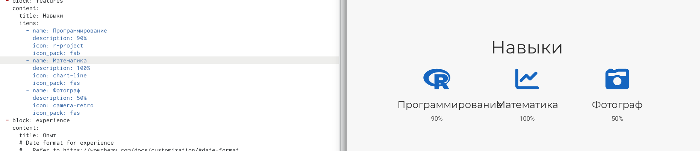
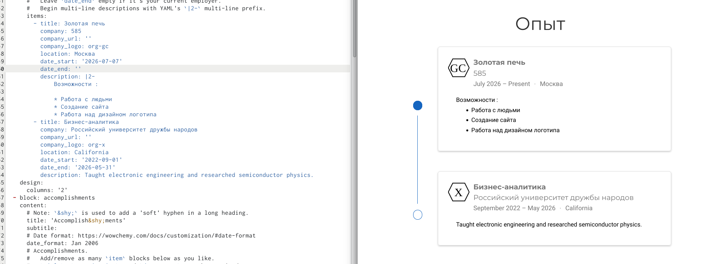
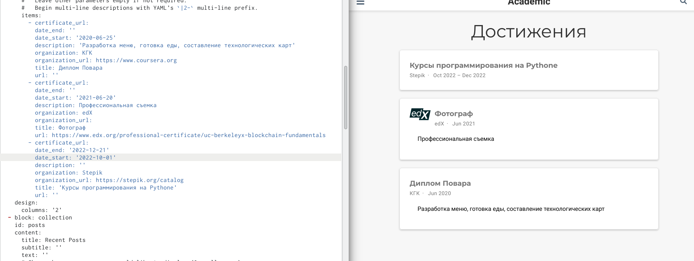
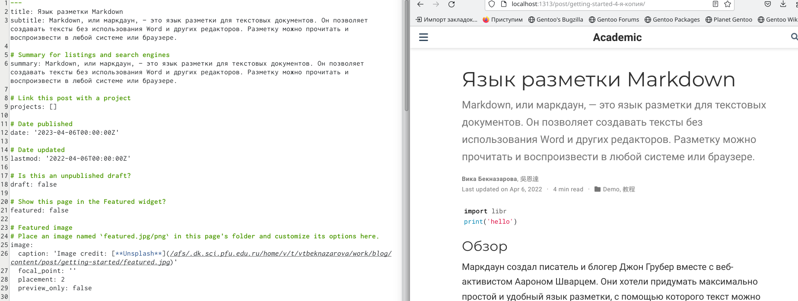
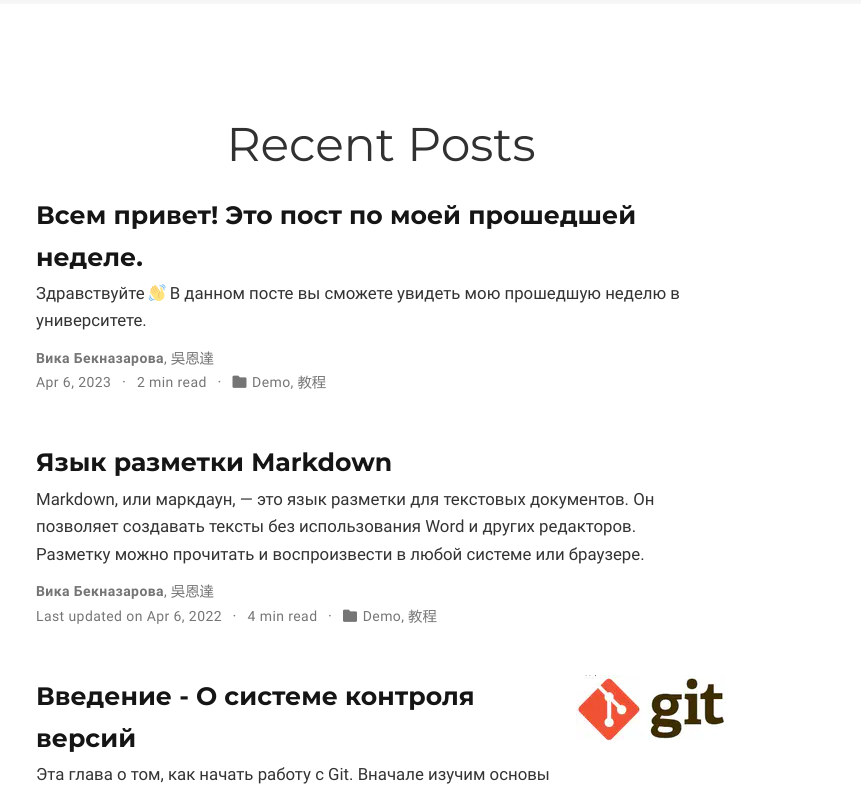

---
## Front matter
lang: ru-RU
title: "Индивидуальный проект"
subtitle: "Третий этап"
author:
  - "Бекназарова Виктория Тиграновна"
institute:
  - Российский университет дружбы народов, Москва, Россия
date: 06 апреля 2023

## i18n babel
babel-lang: russian
babel-otherlangs: english

## Formatting pdf
toc: false
toc-title: Содержание
slide_level: 2
aspectratio: 169
section-titles: true
theme: metropolis
header-includes:
 - \metroset{progressbar=frametitle,sectionpage=progressbar,numbering=fraction}
 - '\makeatletter'
 - '\beamer@ignorenonframefalse'
 - '\makeatother'
---

## Цели и задачи

Добавление к сайту достижений

## Содержание исследования

1. Добавляем информацию о своих навыках 

{#fig:001 width=70%}

##

2. Добавляем информацию о своем опыте 

{#fig:002 width=70%}

##

3. Добавляем информацию о своем опыте 

{#fig:003 width=70%}

##

4. Добавляем пост о языке разметки Markdown 

{#fig:004 width=70%}

##

5. Добавляем поста по прошедшей неделе 

{#fig:005 width=70%}

## Результаты

Мы добавили к сайту достижения
