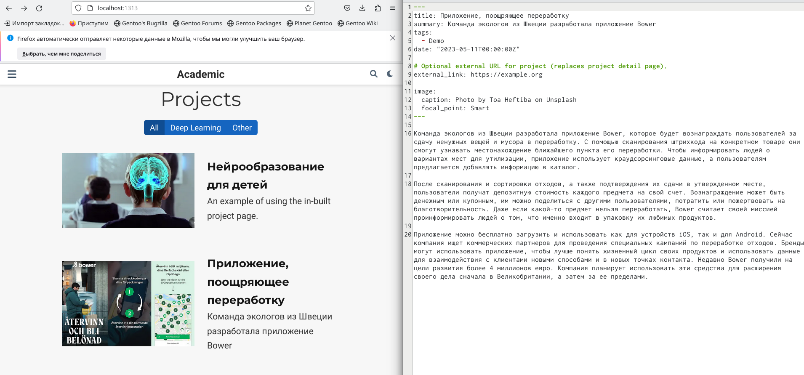
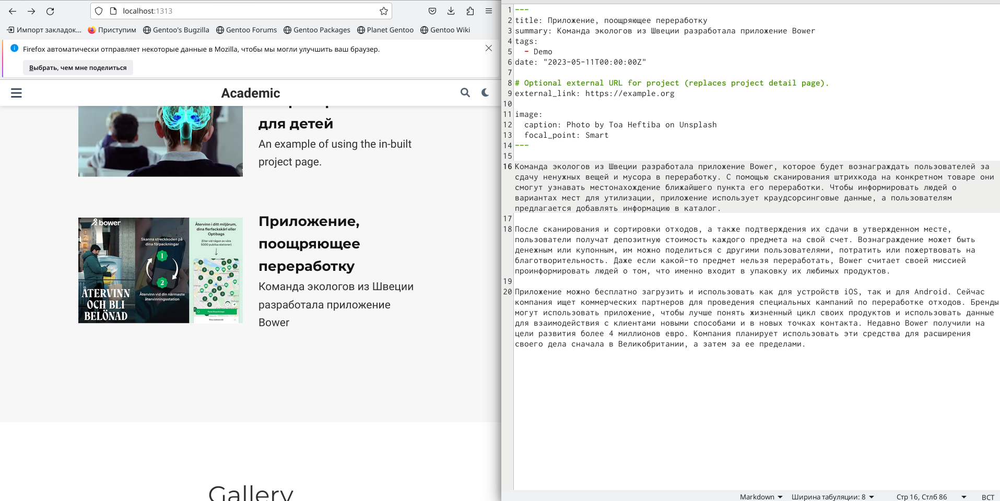
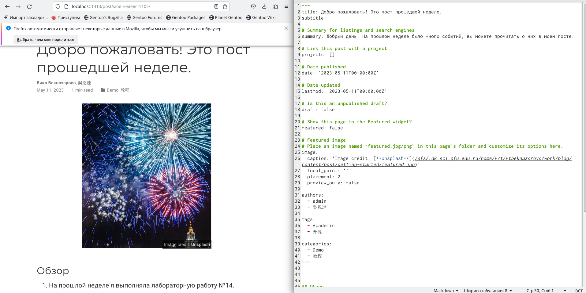
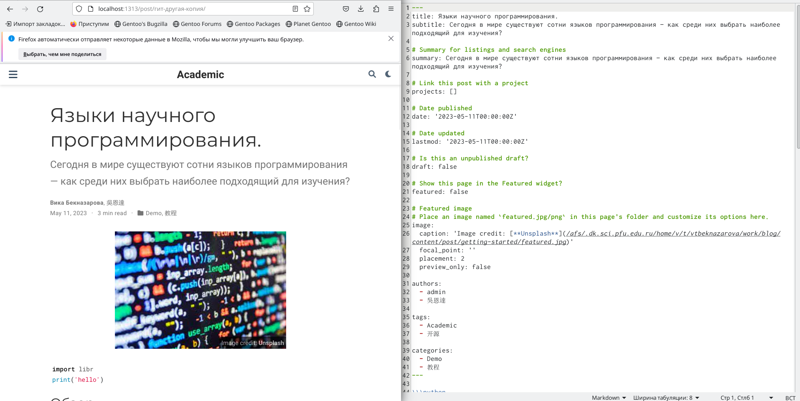

---
## Front matter
lang: ru-RU
title: Индивидуальный проект
subtitle: Этап 5
author:
  - Бекназарова Виктория Тиграновна
institute:
  - Российский университет дружбы народов, Москва, Россия
date: 11 мая 2023

## i18n babel
babel-lang: russian
babel-otherlangs: english

## Formatting pdf
toc: false
toc-title: Содержание
slide_level: 2
aspectratio: 169
section-titles: true
theme: metropolis
header-includes:
 - \metroset{progressbar=frametitle,sectionpage=progressbar,numbering=fraction}
 - '\makeatletter'
 - '\beamer@ignorenonframefalse'
 - '\makeatother'
---

## Цели и задачи

Добавить к сайту все остальные элементы.

## Содержание исследования

1. Сделать записи для персональных проектов 

{#fig:001 width=70%}

##

{#fig:002 width=70%}

##

2. Пишем пост по прошедшей неделе 

{#fig:003 width=70%}

##

3. Пишем пост про Научные языки программирования 

{#fig:004 width=70%}

## Результаты

Я добавила к сайту все остальные элементы.

